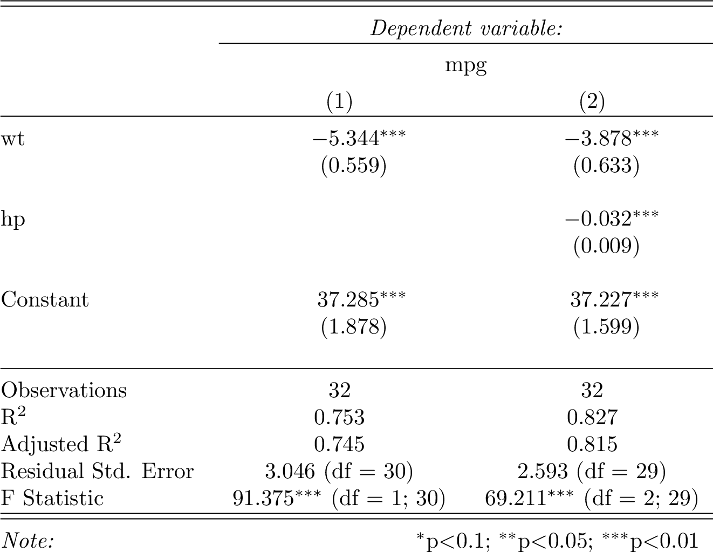
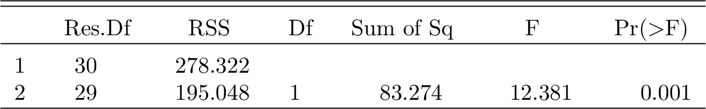
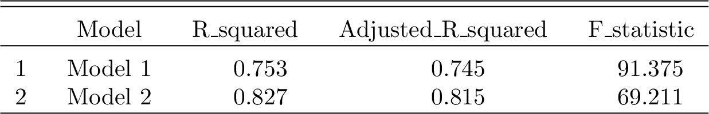

# Methodology

## Model Summaries

This section contains summaries of the models used in the analysis.

## ANOVA Comparison

Here we compare different models using ANOVA.

## Additional Metrics

This section discusses additional metrics used in the analysis.

